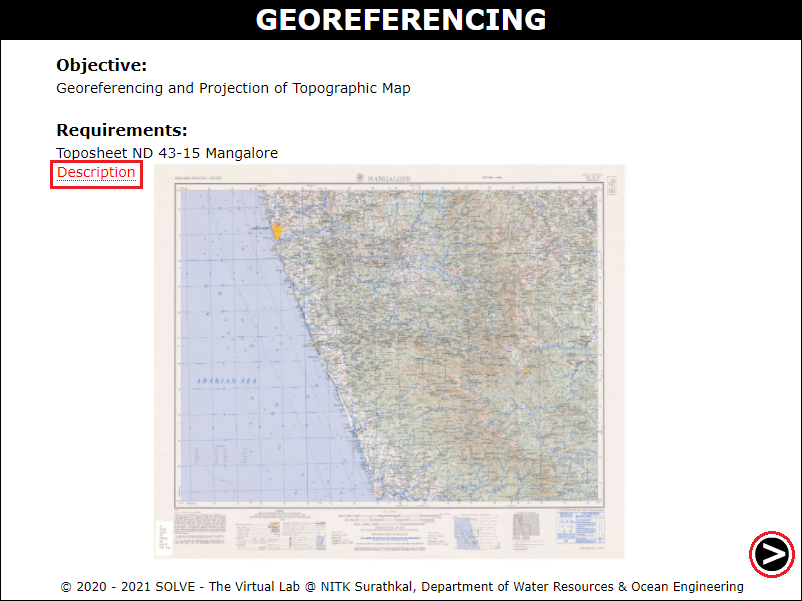
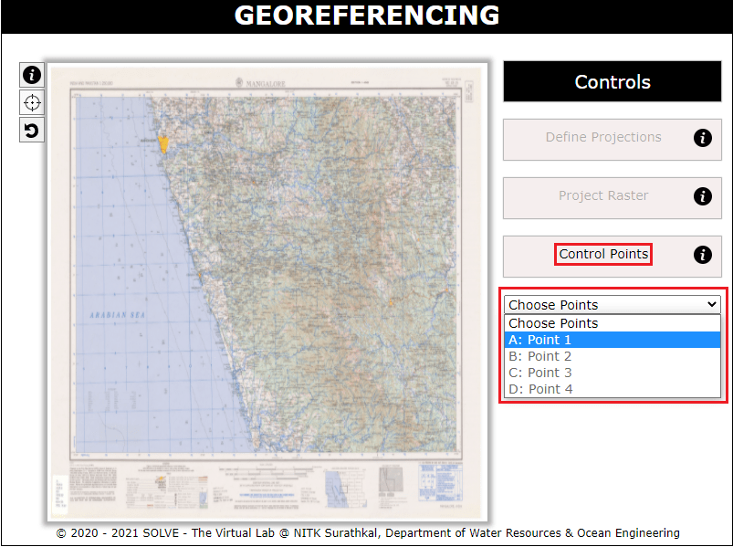
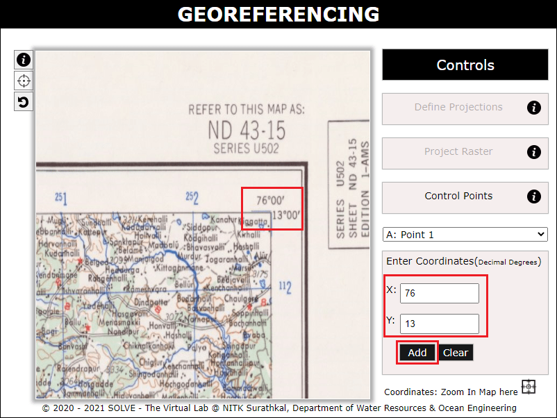
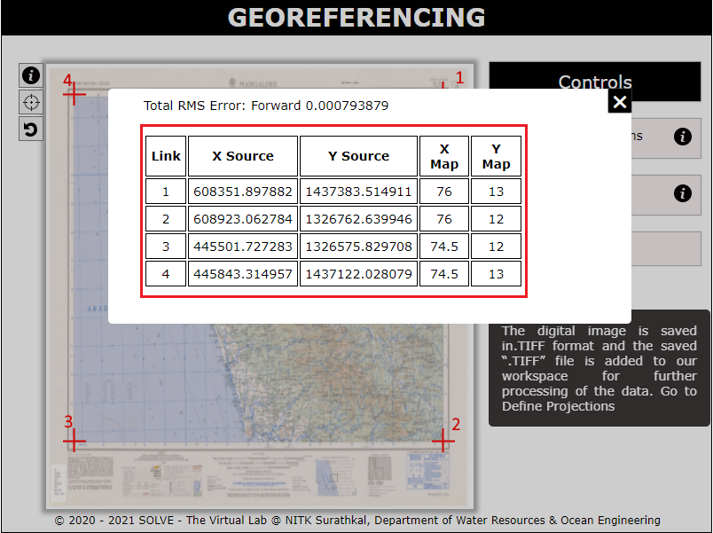
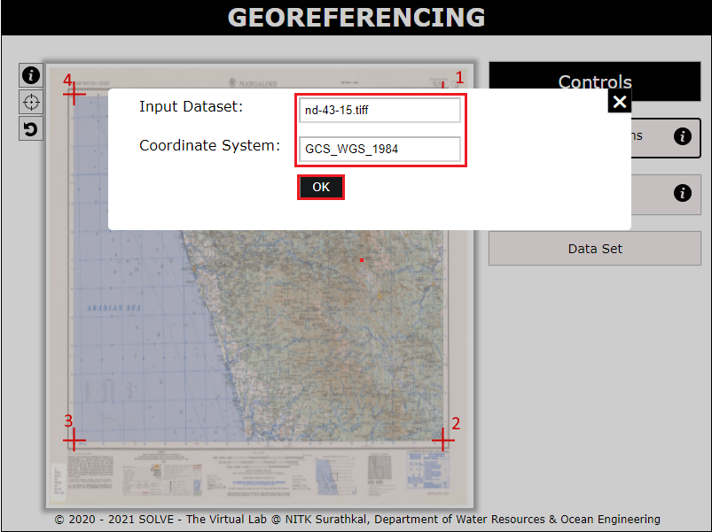
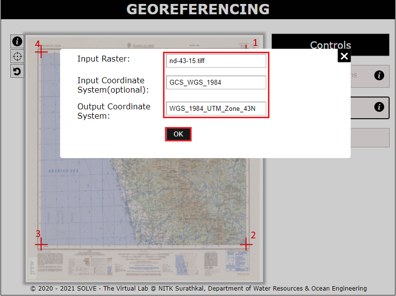
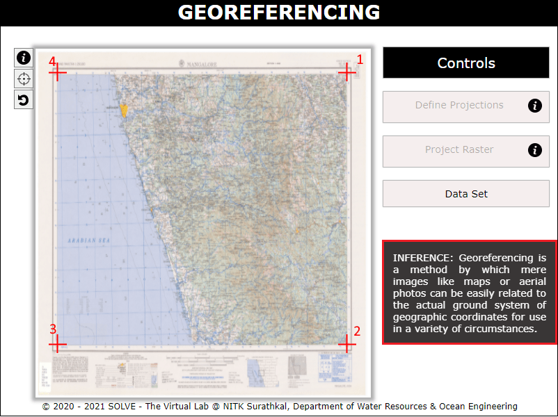

#### These procedure steps will be followed on the simulator

1. Open the Georeferencing experiment a window will open with objectives and requirements, click on description to understand the terminologies in the experiment, click on the NEXT button to proceed.  
  

2. Click on the control points tab and select point 1 to proceed.  

3. Zoom in to the corner points in order to enter the X and Y coordinate in the map. Click on “Add“ to proceed to the next point. Similarly add all the four corner points.  
  

4. Click on the dataset tab to view the entered X and Y coordinate and the RMS Error obtained.  
  

5. Click on the define projections tab to view the geographic coordinate system entered and click on OK to proceed.  
  
 

6. Click on the project raster tab to view the projected coordinate system entered and click on OK to proceed.
   
  

7. Obtain the Inference and go through it.  
  

